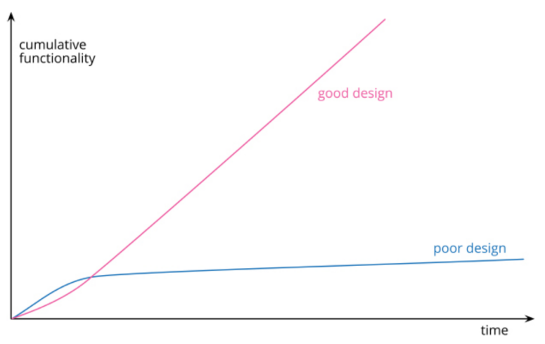

# refactoring-2nd-edition
My notes for Refactoring 2nd edition by Martin Fowler

## Chapter 01
- When you have to add a feature to a program but the code is not structured in a convenient way, first refactor the program to make it easy to add the feature, then add the feature.
- Features requests will change again within six months.

- **Refactor Steps #1: Create Tests** 
    - Ensure to have solid suite of tests for that section of code. 
    - The tests are essential to avoid introducing bugs. As humans, we can make mistakes.
    - These tests must be self-checking.

- **Refactoring Steps #2: Decompose Large Functions**
    - In decomposing large functions, the first step is to eyeball the code and look for groupings or chunks. These can be conditionals (switch or an if-else block), commented code, or even line spacing.
    - Extract the chunk of code into a separate function and name accordingly. This method is also knows as **Extract Fuction**.
    - Refactor code in smalls steps so it is easy to find any bugs introduced.
    
- **Refactoring Steps #3: Refactor, Test and Commit** 
    - Test code after small changes.
    - **TIP: Use git to commit every successful refactoring**
    - This allows us to easily get back to a working state should we mess up later.
    - Squash changes into significant commits before pushing to remote.

- **TIP: You can use the name "result" for the return value in a function.**

- **NOTE:** What about performance?
    - Performance is important but refactoring always comes first.
    - Refactored code makes performance tuning better and more effective.

- **Recatoring Steps #4: Replace Conditionals with Polymorphism**
    - Large switch and if blocks are glaring issues and must be transferred to separate classes.
    - This ensures readability and making into code smaller bits.

- **Rectoring methods used in Chapter 01:**
    - Extract Function
    - Inline Variable
    - Move Function
    - Replace Conditional with Polymorphism
    - Split Phase

- **Final Thoughts:**
    - The true test of good code is how easy it is to change it.
    - Code should be obvious: When someone needs to make a change, they should be able to find the code to be changed easily and to make the change quickly without introducing any errors.

 

---

 

## Chapter 02 - Principles in Refactoring
- **Refactoring:**
    - *noun:* a change made to the internal structure of software to make it easier to understand and cheaper to modify without change its observable behavior
        - ex., Extract Function, Replace Conditional with Polymorphism
    - *verb:* to restructure software by applying a series of refactorings without changing its observable behavior

- Each individual refactoring is small thus, the code is never broken, allowing anyone to stop at any moment.

- **NOTE:** If someone says their code was broken for a couple of days while they are refactoring, you can be pretty sure they were not refactoring.

- **Why should we refactor?**
    - **Refactoring improves the design of software**
        - Without refactoring, the architecture/internal design of the software tends to decay.
        - Poorly designed code usually takes more code to do the same things, with duplicates in several places.
        - The more code there is, the harder it is to modify correctly.
        - There's more code to understand.

    - **Refactoring makes software easier to understand**
        - Refactoring helps the code more readable.
        - It helps the future developer to make a change. This could be you or other members of the team.

    - **Refactoring helps me find bugs**
        - *"I am not a great programmer; I'm just a good programmer with great habits"* - Kent Beck
        - Refactoring allows deeper understanding of what the code does, and put it to new understanding right back into code.
        - This helps clarify assumptions and even spot bugs.    

    - **Refactoring helps me program faster**
        - Design Stamina Hypothesis:

            
        - Refactoring takes a lot of small steps. It make take some time but the resulting software will have better internal quality - good design, modularity and architecture.
        - The code is clear, which makes it easy to add changes and less likely to introduce bugs.
        - By putting our effort into a good internal design, we increase the stamina of the software effort, allowing us to go faster for longer.
        - Good design if very difficult to do upfront. Refactoring becomes vital to achieving that virtuous path of rapid functionality.

- **When should we refactor?**
    - Refactoring is done every hour. It fits in any workflow.
    
    - **The Rule of Three by Don Roberts**
        - The first time you do something, you just do it.
        - The second time you do something similar, you wince at the duplication, but you do the duplicate thing anyway.
        - The third time you do something similar, you refactor.
        - OR in baseball: Three strikes, then you refactor.

    - **Preparatory Refactoring - Making it easier to add a feature**
        - The best time to refactor is jsut before adding a new feature to the code base.
        - Look at the existing code and see if a little bit restructuring can make the update much easier.
        - Example:
            - https://martinfowler.com/articles/preparatory-refactoring-example.html
            - *It's like I want to go 100 miles east but instead of just traipsing through the woods, I'm going to drive 20 miles north to the highway and then I'm going to go 100 miles east at three times the speed I could have if I just went straight there. When people are pushing you to just go straight there, sometimes you need to say, "Wait, I need to check the map and find the quickest route." The preparatory refactoring does that for me. -- Jessica Kerr*
        - This same happengs to the following:
            - Fixing Bugs - it could be easier to combine copied code into one and fix the error one time.
            - Or separating update/command logic with queries.
    
    - **Comprehension Refactoring: Making code easier to understand**
        - We need to understand the code before changing it.
        - We can refactoring this code to make understanding it more apparent.
        - **TIP:** Try to put in code your understanding.
        - *By refactoring, I move the understanding from my head into the code itself. I then test that undestanding by running the software to see if is still works. If I move my understanding into the code, it will be preserved longer and be visible to my colleagues. -- Ward Cunningham*
        - Example:
            - renaming variables
            - chopping long functions into small parts
            - transferring conditional code to classes
        - Fiddle with the code, and find the opportunities hidden behind the confusion.
    
    - **Litter-Pickup Refactoring**
        - *Leave the camp site cleaner than when you found it. -- some random Boy Scout*
        - Make the code a little bit better each time you pass through it and over time it will get fixed.
        - The nice thing about refactoring, the code is never broken since it is done in small steps.
        - So, sometimes, it takes months to complete the refactoring but the code is never broken.

    - **Planned and Opportunistic Refactoring**
        - Refactoring is not an activity that is separated from programming.
        - It is part of the natural flow of programming - adding a feature or fixing a bug.
        - **NOTE:** You have to refactor when you run into ugly code - but excellent code needs plenty of refactoring too.
        - *For each desired change, make the change easy (warning: this may be hard), then make the easy change -- Kent Beck*

    - **Long-Term Refactoring**
        - There are some large refactoring efforts that can take a team weeks to complete.
        - As much as possible avoid dedicated refactoring, ex., 1 week of just refactoring.
        - A better strategy is to gradually work on the problem over the next few weeks.
        - Take advantage of the fact that refactoring does not break code - each small change leaves everything in a still-working state.
        - Do it step-by-step.

    - **Refactoring in a Code Review**
        - Code reviews help spread knowledge through a development team, pass knowledge to less experienced developers, help people understand more aspects of a large software system.
        - My code may look clear to me but not to my team.
        - **Pull Request Model**
            - This is not advised by the author since the reviewer only looks at code without the original author.
        - **Pair Programming**
            - It is beetter to have the original author of the code and provide context.
            - Sit one-on-one with the original author, going through the code and refactoring as we go.

- **What do I tell my manager?**
    - Don't tell!
    - Software developers are professionals.
    - Our job is to build effectove software as rapidly as we can. 
    - A schedule-driven manager want us to do things the fastest way, and how to do it is our responsibility.
    - We are being paid for our expertise in programming new capabilities fast, and the fastest way is by refactoring - therefore refactor.

- **When should I not refactor?**
    - When ugly code that can be treated as an API.
    - When you are only calling/using it and never update it.
    - When it is better rewrite it and than to refactor it. This requires good judgement and experience.

- **Problems with Refactoring**
    - **Slowing Down New Features**
        - **NOTE:** The whole purpose of refactoring is to make us program faster, producing more value with less effort.
        - The point of refactoring is not to show how sparkly a code base is -- it is purely economic.
        - We refactor beacuse it makes us faster -- faster to add features, faster to fix bugs.
        - "Clean code", "good engineering practice", or similar moral reasons are not real reason to refactor.

    - **Code Ownership**
        - Code ownership boundaries can get in the way of refactoring because we cannot make the changes we want without breaking clients - API's, published interface, etc.
        - This should not stop refactoring but it does impose limitations.
        - Example:
            - When renaming functions, we can retain the old declaration as a pass-through to the new one.
            - Mark old interface as deprecated and retire it in the future.
        - Teams should not work in silos. Allow a more permissive ownership scheme across teams.

    - **Branches**
        - Feature branches are commonly used. However, the longer we work on an isolated branch, the harder it is to integrate in the main branch.
        - This is where CI or Trunk-Based Development can help us.
        - With CI, each team member integrates with the mainline at least once per day. This prevents branches diverting too far from each other and thus greatly reduces the complexity of merges.
        - Why CI is BETTER than Feature Branching? https://www.youtube.com/watch?v=lXQEi1O5IOI
        - Tools of CI:
            - Dark Launching
            - Branch by Abstraction
            - Feature Toggles 
                - Also known as feature flags or feature switches.
                - This allows developers to control the release and activation of specific features in an application. 
                - With feature toggles, developers can enable or disable certain functionality without the need to deploy new code or release new versions of the software.
                - This works by introducing conditional statements in the code that check the state of a toggle variable or configuration setting. Based on the toggle state can be controlled through various means, such as configuration files, environment variables, or a centralized configuration management system.
        - My approach:
            - Approach #1:
                - Release branch: for CI/trunk-based dev                
                - Feature Toggles for big changes or experimental code
            - Approach #2:
                - Small Task/Feature branches
                - PR within the day, then integrate to mainline
        - CI and refactoring work well together.
        - Even if not going full CI, we must integrate changes as frequently as possible.
        - 

    - **Testing**
        - Refactorings are done in small steps. Ensuring that it does not change the observable behavior of the application.
        - However, we are humans and it is normal for us to make mistakes.
        - How do we spot them? Self-testing code is the answer. This could be the following.
            - Unit tests
            - Automated tests - UI/UX

    - **Legacy Code**
        - There is no simple answer to this. Refactoring legacy code is hard.
        - These projects may have few or no tests at all, very hard to read and written by someone who already left the company.
        - The best approach is add tests.
        - The unit tests will be tricky since the code may not be testable at all. 
        - *We need to get the system under tests by finding seams in the program where we can insert tests. Createing these seams involves refactoring -- which is much more dangerous since it's done without tests, but is a necessary risk to make progress. -- Working Effectivelty with Legacy Code by Feather*

    - **Databases**
        - https://martinfowler.com/books/refactoringDatabases.html
        - Ensure that changes/updates are small and incremental
        - Use a migration tool
        - Database changes are best separated over multiple releases to production
        - This makes it easy to reverse any change that causes a problem in production

- **Refactoring, Architecture and YAGNI**
    - Architectoral decisions are made based on the current requirements.
    - Some pre-thinking is needed but it should not be left to decay over time.
    - Consistent refactoring is applied to the codebase to make it update to date with the current requirements.
    - *You aren't gonna need it (YAGNI) is a principle of extreme programming (XP) that states a programmer should not add functionality until deemed necessary. XP co-founder Ron Jeffries has written: "Always implement things when you actually need them, never when you just foresee that you need them."*
    - Adopting YAGNI does not mean we should neglect all upfront architectural thinking. But we are more inclined to deal with the problems later when we understand them better.
    - This means architecture is not a one-time activity. It is a continuous process of refactoring and improving the codebase.
    - Architecture is evolutionary and architect explore the patterns and practices to iterate over architectural decisions.

- **Refactoring and the wider Software Development Process**
    - 

- **Refactoring and Performance**
    - Refactoring may affect performance.
    - To make the software easier to read and understand, changes will cause the program to run slower.
    - But it also makes the software more amendable to performance tuning.
    - *The secret to fast software - write tunable software first, and then ture it for sufficient speed.*
    - Even if you know exactly what is going on in your system, measure performance, don't speculate. You'll learn something, and nine times out of then, it won't be that you were right!

- **Where did refactoring come from?**

- **Automated Refactorings**
        
 

---

 

## Chapter 3 - Bad Smells in Code
- *If it stinks, change it. - Grandma Beck, discussing child-rearing philosophy*
- **Code Smells**
    - Code smells are indicators of problems that can be
addressed during refactoring. Code smells are
easy to spot and fix, but they may be just
symptoms of a deeper problem
with code.
- **Mysterios Name**
    - The name of a variable, function, class, or any other element of code should clearly describe its purpose.
    - If a name requires a comment, then the name does not reveal its intent.

- **Duplicated Code**
    - Duplication means that every time you read these copies, you have to read them carefully to see if they are the same or different.
    - If you change one copy, you have to remember to change the other copy, too.

- **Long Method**
    - The longer a method is, the more difficult it is to understand.
    - *TIP: Whenever we feel the need to comment something, we should consider extracting the code into a separate method.*
    - The key here is not function length but the semantic distance between what the method does and how it does it.
    - Reduce the number of parameters and temporary variables.
    - Extract switches, loops, and other logic into separate methods.
    - Look for comments and extract the code into a separate method.

- **Long Parameter List**
    - The more parameters a method has, the more complex it is.
    - *TIP: If you have a method with more than three parameters, you should consider creating a class to hold the parameters.*
    - Classes are a great way to reduce parameter list sizes.

- **Global Data**
    - The problem with global data is that it can be changed from anywhere in the code.
    - The key defense here is Encapsulation. Wrapped by a class and a function.
    - Global data is especially nasty when it is mutable.

- **Mutable Data**
    - Changes to data can often lead to unexpected consequences and tricky bugs.
    - Functional proramming - is based on the notion that data should never change and that updating data should be done by creating new data, leaving the old data pristine.
    - Mutable data isn't a big problem when it's a variable whose scope is just a couple of lines--but its risk increases as its scope grows.

- **Divergent Change**
    - Divergent change is when one module is commonly changed in different ways for different reasons.

- **Shotgun Surgery**
    - Shotgun surgery is the opposite of divergent change. It's when you make a change that forces you to make many others in various, unrelated modules.
    - A useful tactic for shotgun surgery is to use inlining refactorings to move the code from the many places it is used to a single place.
    - You will end up with a long method or a large class, but can then use extractions to break it up into more sensible pieces.

- **Feature Envy**
    - Feature envy is when a method seems more interested in a class other than the one it actually is in.
    - The fundamental rule of thumb is to put things together that change together, and keep things that change for different reasons apart.

- **Data Clumps**
    - Data clumps are groups of variables that are always used together: as fields in a couple of classes, as parameters in many methods, and so on.
    - *TIP: Whenever you see a data clump, you should consider replacing it with a class.*
    - You'll notice that we advocate creating a class here, not a simple record structure. Using a class gives you the opportunity to add behavior to the data, which is often useful.

- **Primitive Obsession**
    - Primitive obsession is when you have a code that uses primitive data types for everything, without using abstractions such as classes to represent the business concepts.
    - Strings are particularly common targets for primitive obsession. They are often used to represent things like names, addresses, and phone numbers.
    - *TIP: Whenever you see a primitive obsession, you should consider replacing it with a class.*

- **Repeated Switches**
    - Repeated switches are when you see the same conditional switch statement in many places.
    - *TIP: Whenever you see a repeated switch, you should consider replacing it with polymorphism.*

- **Loops**
    - Replace Loop with Pipeline - https://refactoring.com/catalog/replaceLoopWithPipeline.html
    - We find that pipelines, such as `filter` and `map`, are easier to read and understand than loops.

- **Lazy Element**
    - Lazy element is when you see a data structure that is filled with elements that are not used.
    - *TIP: Whenever you see a lazy element, you should consider removing it.*
    - Use Inline Function or Inline Class to remove the lazy element.

- **Speculative Generality**
    - Speculative generality is when you see unused abstractions, such as classes, methods, fields, and parameters.
    - If you have abstract classes that aren't doing much, use Collapse Hierarchy.
    - Unecessary delegation can be removed with Inline Function or Inline Class.
    - Function parameters that aren't used can be removed with Remove Parameter/Change Function Declaration.

- **Temporary Field**
    - Temporary field is when you see an instance field that is set only in certain circumstances.
    - *TIP: Whenever you see a temporary field, you should consider replacing it with a local variable.*

- **Message Chains**
    - Message chains are when you see a series of calls to get to a particular object.
    - You may see these as a long line of `getThis` methods, or as a sequence of temps.

- **Middle Man**
    - Middle man is when you see a class that delegates all of its methods to another class.
    - You look at a class's interface and find half the methods are delegating to another class.

- **Insider Trading**
    - Insider trading is when you see a class that uses information it shouldn't have access to.

- **Large Class**
    - Large class is when you see a class that has grown too large.
    - *TIP: Whenever you see a large class, you should consider using Extract Class to break it up into smaller classes.*

- **Alternative Classes with Different Interfaces**
    - Alternative classes with different interfaces is when you see two classes that do similar things but have different method names.

- **Data Class**
    - Data class is when you see a class that has fields and simple accessors and mutators for those fields, but nothing else.

- **Refused Bequest**
    - Refused bequest is when you see a subclass that uses only some of the methods and properties inherited from its parents.

- **Comments**
    - Comments are when you see comments that are not necessary.
    - Comments are often used as a deodorant. They are used to cover up a code smell.
    - Comments are often used as a crutch. They are used to explain code that is not well written.
    - Comments lead us to bad code and opportunities to refactoring.

 

---

 

## Chapter 4 - Building Tests
